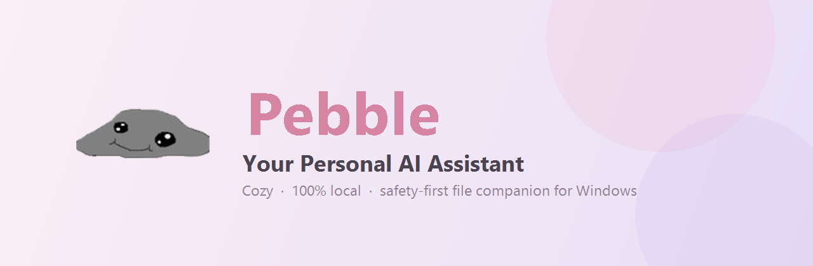
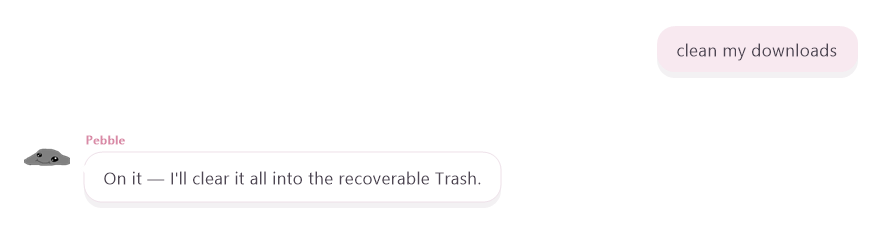
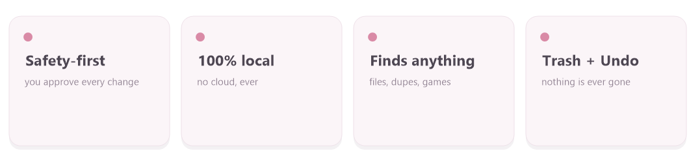
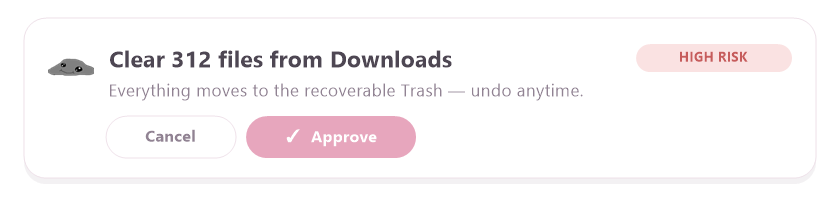
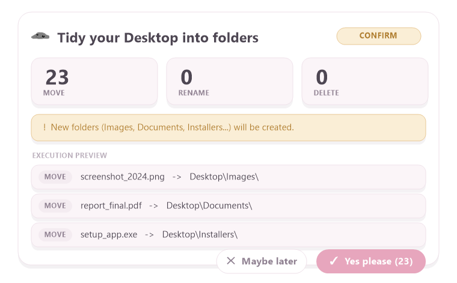
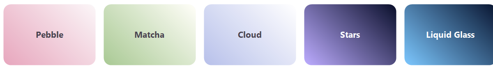

<div align="center">



<p>
  
  
  
  
</p>

### Your cozy, **local**, safety‑first AI that tidies your computer. 🪨

<p>
  <a href="https://github.com/dasler08/Pebble---Your-Personal-Ai-Assistant/releases/latest"><b>⬇&nbsp; Download for Windows</b></a>
  &nbsp;•&nbsp;
  <a href="https://dasler08.github.io/Pebble---Your-Personal-Ai-Assistant/"><b>🌐&nbsp; Website</b></a>
  &nbsp;•&nbsp;
  <a href="https://discord.gg/rYEp7dPxhY"><b>💬&nbsp; Discord</b></a>
</p>

</div>

**Tell a little rock to clean up your PC in plain English.** Pebble *proposes* the change, you approve it, and nothing is ever deleted for good. He runs **100% on your machine** with your own [Ollama](https://ollama.com) model — no cloud, no accounts, no telemetry.

<div align="center"></div>

## Why Pebble?

Every other AI assistant either lives in the **cloud** (your files, someone else's computer) or is happy to run commands that can **wreck your stuff**. Pebble is the opposite on both counts:

- **It's yours.** Runs locally through Ollama. Your files and chats never leave your PC.
- **It can't go rogue.** The AI only ever *proposes* actions. An independent safety layer checks every one, blocks system folders, and does **nothing** without your okay. Deletes go to a recoverable Trash, and every action can be undone.

<div align="center"></div>

## See it in action

**Clean out a folder.** Say *"clean my downloads"* and Pebble proposes clearing it into the recoverable Trash — one click, fully reversible.

<div align="center"></div>

**Organize the chaos.** *"organize my desktop by type"* turns into a preview card showing exactly what moves where, before anything happens.

<div align="center"></div>

**Find anything.** *"find my biggest files"*, *"find duplicate files"*, *"what's eating my storage?"*, even *"where are my Steam games?"* — he searches your folders, Program Files, and drives.

**Make it yours.** Five cozy themes, your name, and Pebble's vibe.

<div align="center">
  
  <br /><sub>Pebble · Matcha · Cloud · Stars · Liquid Glass</sub>
</div>

## How it works

The model never touches your files. It can only emit *proposed* actions; a separate validator — the **only** code that can authorize anything — checks each one, and it's enforced at the type level, so an unapproved action **cannot** reach your disk even by accident.

<div align="center"></div>

1. **You ask** in plain language ("tidy my desktop", "find big files", "clean downloads").
2. **Pebble proposes** concrete steps — never vague, never "done" without doing it.
3. **The Safety Validator checks** every step against protected folders, your sandbox, and risk tiers.
4. **You approve or reject** a clear preview card. High‑risk things ask twice.
5. **Done** — with a recoverable Trash and one‑click Undo behind everything.

| Tier | Examples | Gate |
|------|----------|------|
| **0 — Auto** | find, search, analyze, storage | runs after a path check |
| **1 — Confirm** | move, rename, organize | one‑click approval |
| **2 — High risk** | delete, empty Recycle Bin, run a program | explicit (sometimes typed) confirmation |

**Never modifiable:** `C:\Windows`, `Program Files`, `ProgramData`, `AppData`, drive roots — and changes are sandboxed to your home folder by default (widen it in Settings).

## Quick start

1. **Install [Ollama](https://ollama.com)** and pull a model:
   ```bash
   ollama pull llama3.2
   ```
2. **Download Pebble** from the [latest release](https://github.com/dasler08/Pebble---Your-Personal-Ai-Assistant/releases/latest) and run **`Pebble_0.9.0_x64-setup.exe`** *(or grab the portable `Pebble.exe`)*.
3. **Say hi 🤍** — Pebble greets you, asks your name, checks your PC, and recommends a model that fits.

Everything is stored locally in `C:\AI_Assistant\` (database + recoverable Trash).

## Want a smarter Pebble?

The default `llama3.2:3b` is tiny and fast — great for chatting, weaker at multi‑step organizing. Pebble checks your hardware on launch and recommends an upgrade; pull and switch right inside **Settings → AI Model**.

| Model | Good for | Needs |
|-------|----------|-------|
| `llama3.2:3b` | quick chats, simple finds *(default)* | ~2 GB |
| `llama3.1:8b` | organizing, following steps | ~6 GB |
| `qwen2.5:7b` / `:14b` | strong all‑round / precise tidying | ~6 / ~12 GB |
| `deepseek-r1:8b` | careful step‑by‑step reasoning | ~6 GB |

## "Windows protected your PC" / antivirus warning

A **false positive** — Pebble is open and **unsigned** (code‑signing certs cost money). Click **More info → Run anyway**, add a Windows Security exclusion, or build it yourself below. It only talks to your local Ollama; nothing else leaves your machine.

## Built with

**Tauri 2** · **Rust** · **React + TypeScript** · **SQLite** · **Ollama** — a tiny, fast, fully‑local stack.

```bash
npm install
npm run tauri dev      # run in development
npm run tauri build    # build the installer (src-tauri/target/release/bundle/nsis/)
```

## FAQ

<details>
<summary><b>Is it really free and private?</b></summary>

Yes — free, open source, and fully local through your own Ollama. No cloud, no accounts, nothing leaves your PC.
</details>

<details>
<summary><b>Can it delete my files by mistake?</b></summary>

It's built to make that very hard: Pebble can only propose, the validator blocks system folders and needs your approval, deletes go to a recoverable Trash, and every action can be undone.
</details>

<details>
<summary><b>Which file do I download?</b></summary>

The <b>setup .exe</b> installer (bundles everything, incl. WebView2). A portable <code>Pebble.exe</code> is available too.
</details>

<details>
<summary><b>My PC is powerful — can he be smarter?</b></summary>

Yes. Pebble recommends a stronger model based on your hardware; pull and switch in Settings → AI Model.
</details>

## ⭐ Star History

<a href="https://star-history.com/#dasler08/Pebble---Your-Personal-Ai-Assistant&Date">
  <picture>
    <source media="(prefers-color-scheme: dark)" srcset="https://api.star-history.com/svg?repos=dasler08/Pebble---Your-Personal-Ai-Assistant&type=Date&theme=dark" />
    
  </picture>
</a>

## License

[MIT](LICENSE) — do what you like, just be kind.

<div align="center"><sub>Made with 🤍 — be nice to Pebble.</sub></div>
